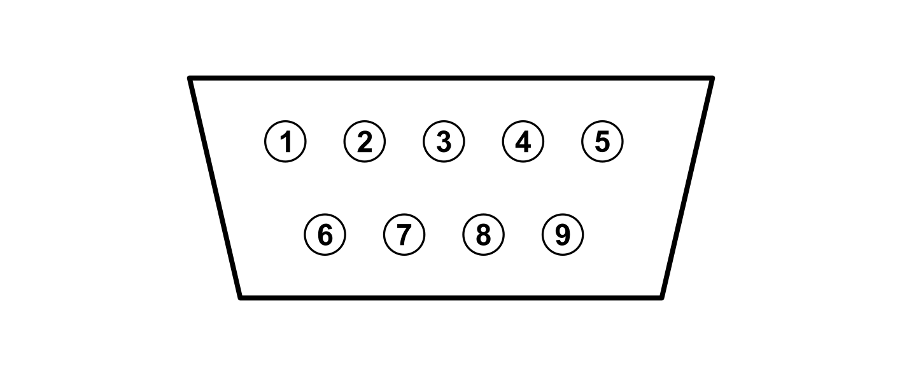
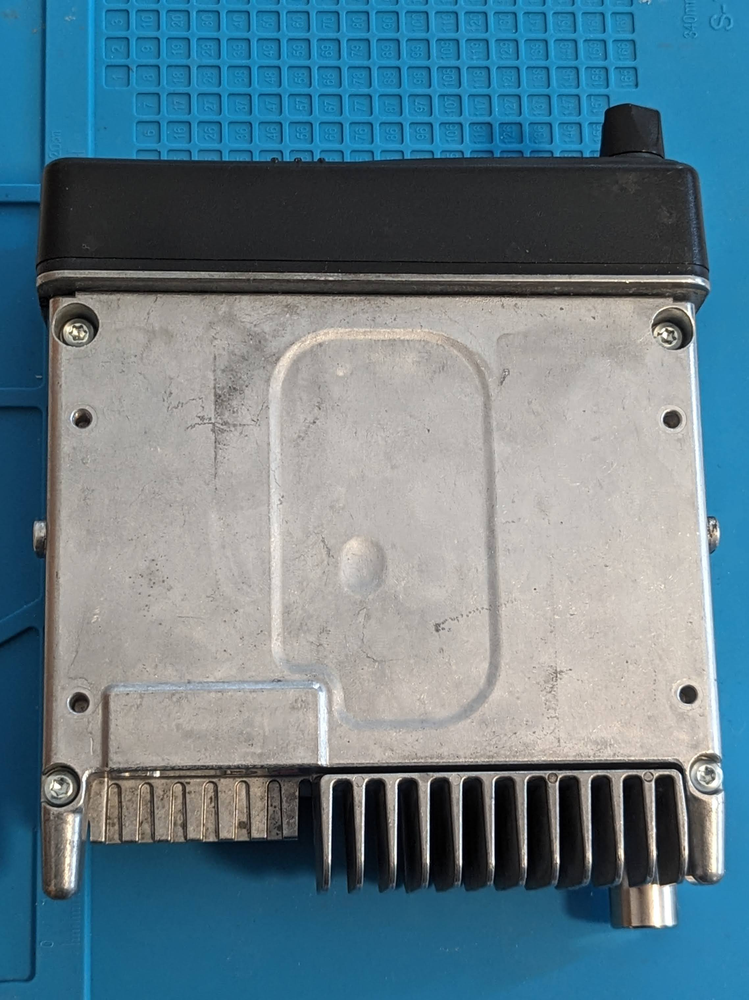
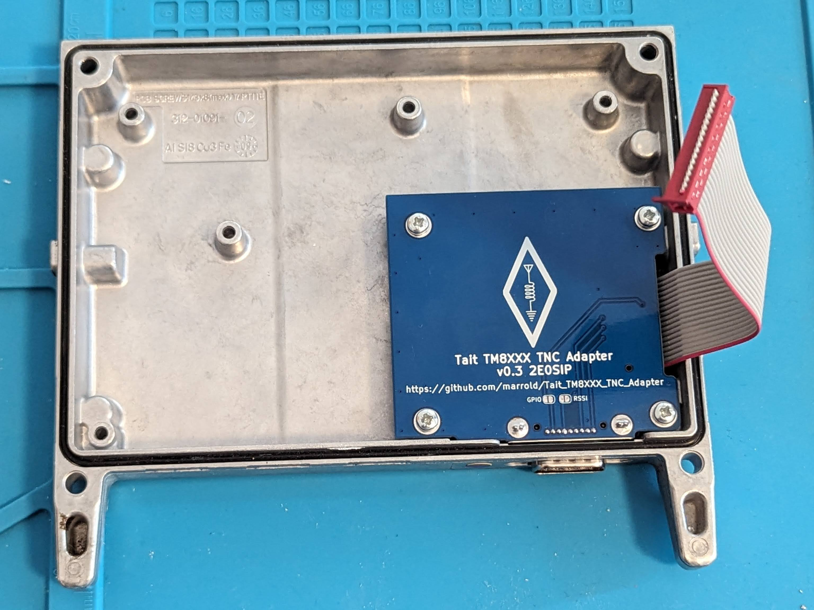
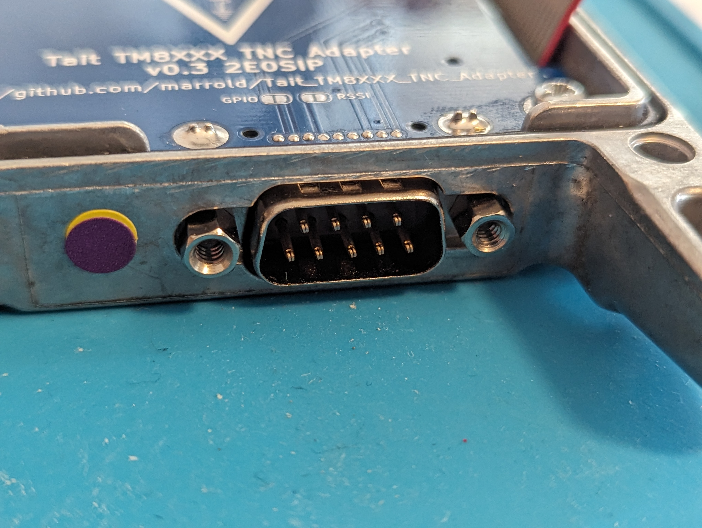
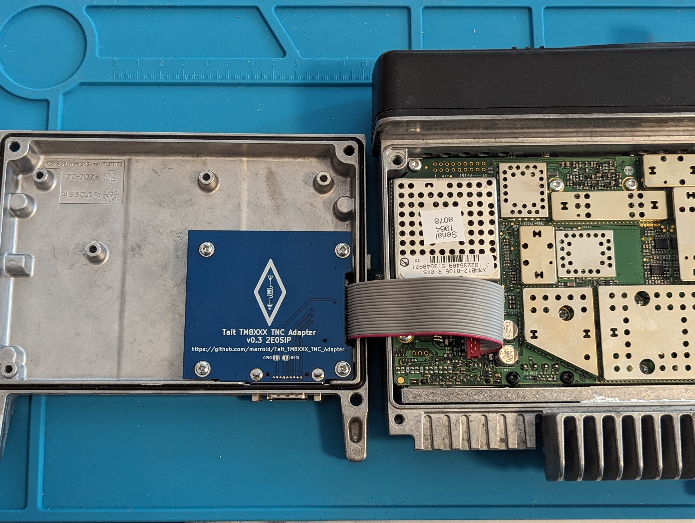

# Tait_TM8XXX_TNC_Adapter

An adapter for the Tait TM8XXX series of radios to breakout the required GPIOs and audio tap points onto a NinoTNC compatible DB9.

Also useful for TS8107 models where the accessory port has been filled with epoxy - note that it's plausible that some TS8107s might have other essential hardware missing or the aux connectors disabled in firmware. YMMV.

## Pinout

Pinout is looking into the connector.

| Pin | Usage | Direction |
|--|--|--|
| 1 | Tx Audio | Input |
| 2 | Busy (GPIO X)     | Output | 
| 3 | PTT | Input |
| 4 | NC | N/A|
| 5 | Rx Audio | Output |
| 6 | Ground | N/A | 
| 7 | NC | N/A|
| 8 | RSSI (Optional)| Output | 
| 9 | GPIO (Optional) | In/Output| 

## Required Tools

 - T20 Torx Screwdriver
 - PZ1 Pozi Screwdriver
 - Soldering Iron
 - Solder
 - Other soldering tools

## Required Parts

 - PCB
 - 18p Micro-MaTch PCB Connector (SMD)
 - 18p Micro-MaTch Ribbon Cable (`75-100mm)
 - [Male "Ultra Thin" DB9](https://www.aliexpress.com/item/32888489053.html)
 - 4x [M3x10mm self tapping screws](https://www.orbitalfasteners.co.uk/products/m3-x-10-pan-pozi-no-1-taptite-alternative-screws-steel-bright-zinc-plated-din-7500-ce-z) 
 -  2x 4-40 Jack Screws 

## Assembling the PCB

What goes where on the board is fairly obvious.

To make sure the red Micro-MaTch connector is soldered in the correct orientation you can fit the ribbon cable to the connector before soldering and ensure the keying pin lines up with the hole in the PCB. With the DB9 facing away from you the ribbon should go to the right.

The DB9 is quite a tight fit and the edge of the board might even require a light filing depending on the tolerances of the connector and the PCB. So far I've managed to avoid this. 

## Fitting the PCB

Remove the plastic cover from the radio by levering it off the mounting points. This should reveal 4x T20 Torx bolts. Undo them and remove the lid from the radio.  

Remove the rubber bung out of the DB9 cut out if fitted, and insert the DB9 connector onto the PCB. Line it up with the mounting posts and screw in the 4x M3x10mm self tapping screws.  These will be a little stiff as they tap the required threads.

Fit the two Jack Screws into the DB9 connector.  

Connect the ribbon cable to the red connector on the radio's main board.

Replace the lid, folding and dressing the cable so it sits correctly.

## License

This project is licensed under the MIT license

